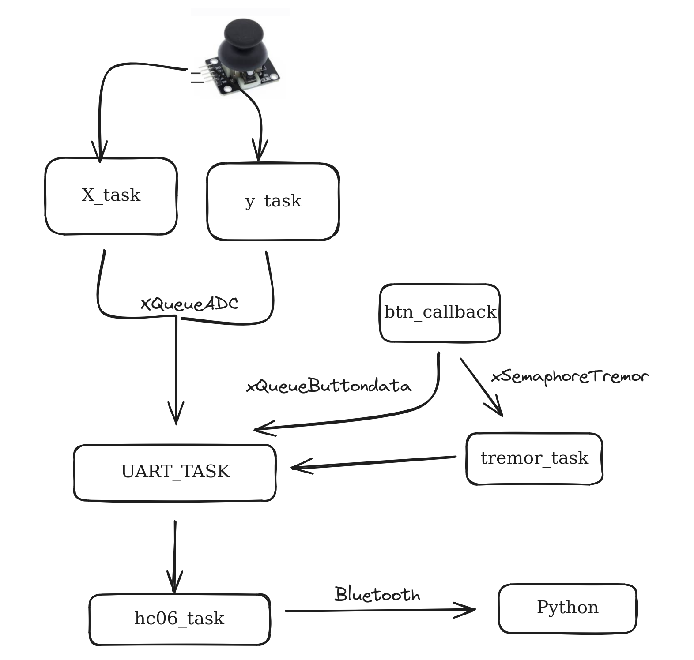

# Esse repositório consiste em um projeto para a matéria de computação embarcada do 5o semestre de Engenharia da computação no Insper.

## Integrantes:
- João Kouznetz Bresser Pereira
- Ricardo Wurzmann

# Como rodar o controle ja compilado:
0- Ligue o controle

1- abra o terminal e rode o codigo ` hcitool scan`

2- O terminal vai devolver uma lista de Disposítivos bluetooth Escolha o `APS2_JB` e copie o valor no lado esquerdo, deve ser algo assim: `98:DA:60:08:7D:1C`

3- Rode no terminal o seguinte comando : `sudo rfcomm connect /dev/rfcomm0 98:DA:60:08:7D:1C`

4- abra outro terminal, com o anterior rodando, entre na pasta python o rode o arquivo main.py, pode ser executado da seguinte forma no linux: ` sudo python3 main.py`

5- O controle já esta funcionando! se divirta!

# Nosso controle tem os arquivos:

### Na pasta python:
- main.py:
    Funcionamento para receptividade com dispositivos de entrada via UART, como um joystick ou um teclado virtual, através da comunicação serial. Ele configura e controla tanto um mouse virtual quanto um teclado virtual para responder a comandos.

### Na pasta main:
- hc06.h:
    Onde estão definidas as constantes para o bluetooth hc06

- hc06.c:
    Código para o funcionamento do bluetooth hc06

- maih.h:
    Onde estão definidas as constantes

- main.c:
    Arquivo no qual a base do nosso projeto está implementado.
    Este projeto implementa um sistema de controle baseado em FreeRTOS para um microcontrolador Raspberry Pi Pico. Utilizando interações entre joystick, botões e um módulo Bluetooth HC-06, o sistema lê e processa entradas analógicas e digitais para comunicação via UART.
    Funcionalidades:

    - Leitura de Joystick: Utiliza o ADC para ler as posições dos eixos X e Y de um joystick e transmite os dados por UART.
    - Detecção de Botões: Monitora múltiplos botões para detectar pressionamentos e liberações. Botões:
        - Esquerdo do Mouse
        - Tecla E
        - Tecla espaço
        - Tecla A
        - Tecla W
        - Tecla S
        - Tecla D
        - Tecla shift
    - Comunicação Bluetooth: Envia pacotes de dados para um dispositivo conectado via Bluetooth utilizando o módulo HC-06.
    - Feedback Tátil: Controla um atuador (tremor) para fornecer feedback tátil baseado em eventos específicos, como o pressionamento de u, botão específico.

# Diagrama de blocos explicativo do firmware:



## Conceitos acumulativos:
Com propósito da matéria foram feitos os seguintes conceitos para aumentar a nota do nosso projeto:
- O jogo está "jogável" com o controle (sem latência, e avalido pela equipe).
- Hardware integrado no controle (bateria e tudo mais)
- Utiliza algum componente não visto em sala de aula (o vibrador por meio do TREMER_PIN, utilizado quando o usuário aperta a botão esquerdo do mouse, para dar mais sentimento visando jogos de tiros)
- Está dividido em arquivos .c e .h
- Entrega vídeo TOP/ stonks:
    - https://drive.google.com/file/d/1W-jNMnVNY4HZ2povQq3fkgTx9mXg_YHf/view?usp=drivesdk
    


# HC06 examplo

Conectar HC06 no 5V e gnd, pino TX no `GP5` e pino RX no `GP4`. Também é necessário conectar o pino `STATE` do bluetooth no pino `GP3`.

O projeto está organizado da seguinte maneira:

- `hc06.h`: Arquivo de headfile com configurações do HC06, tais como pinos, uart, ..
- `hc06.c`: Arquivo `.c` com implementação das funções auxiliares para configurar o módulo bluetooth
    - `bool hc06_check_connection();`
    - `bool hc06_set_name(char name[]);`
    - `bool hc06_set_pin(char pin[]);`
    - `bool hc06_set_at_mode(int on);`
    - `bool hc06_init(char name[], char pin[]);`

- `main.c` Arquivo principal com inicialização do módulo bluetooth

```c
void hc06_task(void *p) {
    uart_init(HC06_UART_ID, HC06_BAUD_RATE);
    gpio_set_function(HC06_TX_PIN, GPIO_FUNC_UART);
    gpio_set_function(HC06_RX_PIN, GPIO_FUNC_UART);
    hc06_init("aps2_legal", "1234");

    while (true) {
        uart_puts(HC06_UART_ID, "OLAAA ");
        vTaskDelay(pdMS_TO_TICKS(100));
    }
}
```

Extra ao que foi feito em sala de aula, eu adicionei o `hc06_set_at_mode` que força o módulo bluetooth entrar em modo `AT`, caso contrário ele fica 
conectado no equipamento e não recebe mais comandos.

## No linux

Para conectar o bluetooth no linux usar os passos descritos no site:

- https://marcqueiroz.wordpress.com/aventuras-com-arduino/configurando-hc-06-bluetooth-module-device-no-ubuntu-12-04/
